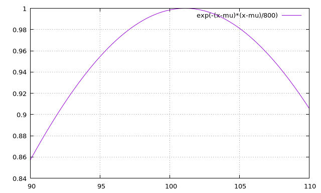

# ganesha-blue
Low latency genetic algorithm solver in CUDA/thrust

This is a single-stream templated C++ multi-kernel genetic solver. It uses
 7 kernels per iteration and can run in either Iterate Mode (low latency - no host transfers),
 or Callback Mode (more flexible - user code called each iteration).

## Approach

The solver leverages the GPU's ability to perform parallel-prefix-sum in a method known as
 [stochastic remainder selection](https://en.wikipedia.org/wiki/Stochastic_universal_sampling) but
 with code to factor out the 'best mate' to prevent population saturation. Ganesha-blue uses double-buffered populations
 split into 3 segments each (in addition to the solitary 'best mate'
 which I'm not calling a segment) and each segment having different mutation parameters. For each new
 population-slot a mate is taken from the previous' population-at-large. This is an approach similar
 to the one taken in an earlier host-only open-mp-capable solver
 [psychic-sniffle](https://github.com/orthopteroid/psychic-sniffle) which had 6 segments.
 
Ganesha-blue uses only simple per-segment mutation parameters (called a Breeding Plan)
 to control the breeding process:
 
* Probability of a single-bit mutation (values are 0...100).
* Number of trials for single-bit mutations (values are 0...N), where N is the number
 of bits in your problem class (ie a float has 32).
 
The default breeding plan uses 5%, 10% and 50% for the single-bit mutation probabilities
 and 1, 1, and 2 for the number of trials in each of the groups. These values were picked
 basically at random, but with a mindset to provide some sort of asymptotic behaviour in
 the 3rd segment of the population (ie high likelyhood of mutation).

The default population size is configured at 60k. This was selected on the basis of a
 bandwidth tradeoff and can easily be changed to accommodate 2^32 members.
 
If the solver is run in Iterate Mode (the default) all kernel calls for all iterations can be queued
 without synchronization from the host CPU. The host then sits back and waits for the GPU to finish
 calculating.
 
If the solver is run is Callback Mode, the GPU iterates then waits for the host CPU callback
 code to determine the termination condition or iterate again. While the callback code is
 running on the host CPU the GPU is doing nothing. If the callback code read states from the
 GPU this can cause further data-transfer delays.

## Example

A worked example finds the inflection point of a narrow normal distribution shaped
 curve (centered at 101.10101) to within .01% using less than 70MB gpu memory.



When making 10 runs in Iterate Mode the GPU is kept busy and the CPU waits for all work to
 complete. This behaviour can be seen by the long call to cudaSynchronize() at the end of the
 call-chart below. 


10 runs of Iterate Mode showed tolerable convergence for the example problem. The results of each run are
 printed on lines below and show the converged
 value, the average time per iteration in msec and the number of iterations (set to 10 in the
 Breeding Plan).
 
 ```
 101.09619, 0.39216, 10
 101.10146, 0.38918, 10
 101.10498, 0.39652, 10
 101.10229, 0.39637, 10
 101.10818, 0.39803, 10
 101.10073, 0.39748, 10
 101.10260, 0.39723, 10
 101.09756, 0.40080, 10
 101.09897, 0.39461, 10
 101.10901, 0.39395, 10
 ```

In this mode, the call-chart for a single iteration shows a total iteration
 time is around 418 usec.
 


If the solver is run is Callback Mode, the GPU iterates then waits for the host CPU callback
 code to determine the termination condition or iterate again. While the callback code is
 running the GPU is doing nothing - hence the long gaps in the call-chart below. In this mode
 the CPU callback code may also read state from the GPU, causing further delays for data-transfer.


 Much of this host-to-device communication can be seen on the call-chart between each iteration.


Zooming in on this Callback Mode call-chart for 1 iteration, the start of
 an iteration can be seen (where the 2 host-to-device copies occur). However, the attached snap
 may not be ideal measure performance because the kernel launches at the start of the
 iteration appear more spread-out than the launches at the start of the next
 iteration, perhaps a result of a device calculation warmup.


In 10 Callback Mode run, most attempts at solving the problem took 2 iterations. The first
 2 or 3 values in each run prints a % convergence value while the latter 3
 values show the converged value, the average time per iteration in msec and the number of iterations.  

```
 0.02083,  0.00338, 101.10443, 0.32810, 2
 0.04884,  0.00014, 101.10115, 0.32058, 2
 0.29213,  0.02335,  0.00628, 101.09467, 0.36369, 3
 0.10390,  0.00575, 101.09520, 0.29678, 2
 0.22560,  0.00241, 101.09857, 0.30898, 2
 0.18105,  0.00667, 101.09427, 0.30314, 2
 0.08458,  0.00276, 101.09822, 0.32608, 2
 0.04787,  0.00440, 101.10546, 0.30458, 2
 0.05838,  0.00560, 101.10667, 0.30302, 2
 0.20327,  0.02152,  0.01986,  0.00115, 101.10217, 0.40389, 4
```

  Iterations take around 400 usec, but total solver time depends upon the solver mode: either Iterate or
 Callback, as the latter ties up the GPU waiting for host CPU code to run.
 In Callback Mode (where host-side convergence tests are
 performed) the solver usually found the answer in 2 iterations but took 25x longer than blindly running
 10 iterations in Iterate Mode. However, if more complex/expensive objective functions were run on the GPU the
 Callback Mode might perform better by knowing to perform fewer iterations.

Future research might invistigate if the solver can be usefully multi-streamed, seeing as how the
 breeding process is parameterized over segments of the population. So far, experiments I've run with
 the current breeding operator presently show a much higher kernel
 launch latency than execution time when multi-streaming. Other factors to consider would be memory access patterns
 of the current breeding operator and/or if a different launch method or operator would be effective.
