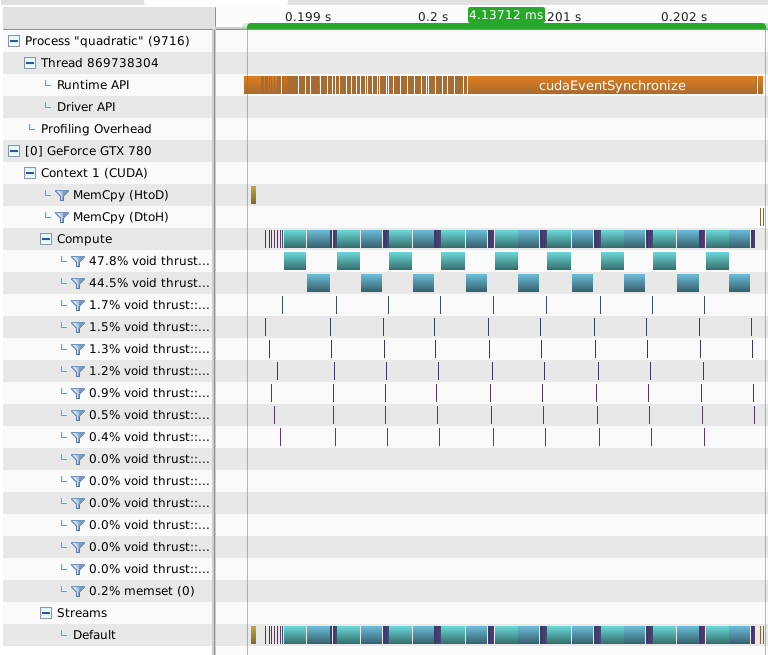
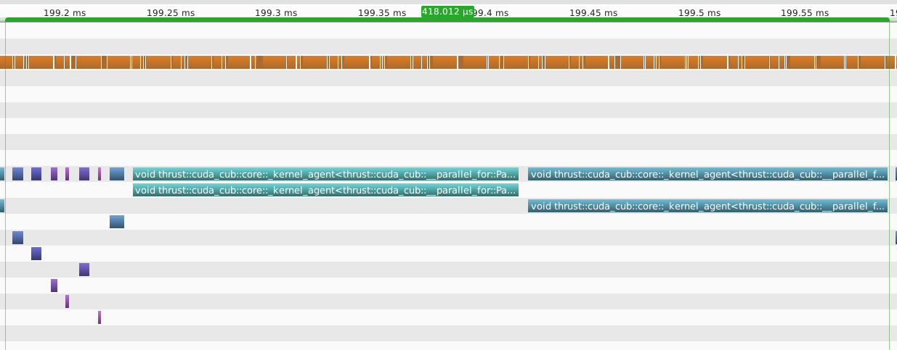
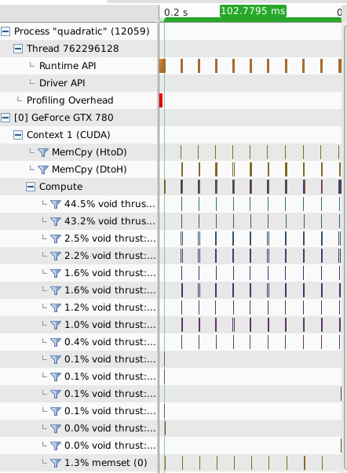
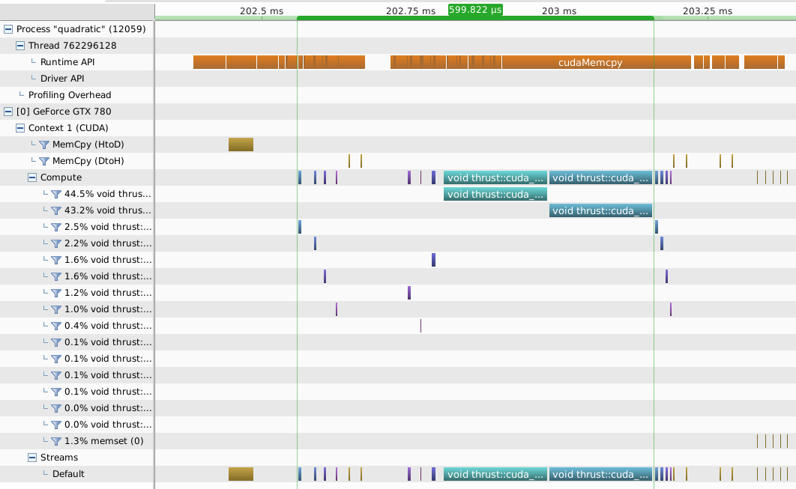

# ganesha_blue
Genetic solver in CUDA/thrust

This is a templated C++ multi-kernel genetic solver. The solver uses
 7 kernels per iteration and can run in either Iterate Mode (the
 default and fastest with no host-device communication between iterations),
 or Callback Mode (requiring host communication so convergence or
 termination conditions can be checked, and so can take much longer). In the
 example presented, the solver found the root of a quadratic function to within .01%
 in 418 usec using less than 70MB gpu memory.
     
 There is also a template parameter that allow configuration of the solver's rather limited
 breeding process, but I've not yet found any reason yet to change from the defaults.
 This is a serial-solver so all operations occur in a single stream (no parallel kernels).
  
The solver uses an approach similar to the one taken in an earlier host-only
 open-mp-capable solver [psychic-sniffle](https://github.com/orthopteroid/psychic-sniffle)
 in that populations are segmented when bred according to different parameter sets but
 selected for breeding across all segments. In psychic-sniffle's case there were 6 segments/groups
 but here in ganesha_blue's case there are only 3 - in addition to the 'best selected'
 which I'm not calling a segment. Ganesha_blue uses the same breeding operator across
 all segments; the only variability are 2 parameters that control the mutation rate:
 
* Probability of a single-bit mutation (values are 0...100).
* Number of trials for single-bit mutations (values are 0...N), where N is the number
 of bits in your problem class (ie a float has 32).
 
The default breeding plan uses 5%, 10% and 50% for the single-bit mutation probabilities
 and 1, 1, and 2 for the number of trials in each of the groups. These values were picked
 basically at random, but with a mindset to provide some sort of asymptotic behaviour in
 the 3rd segment of the population.

Additionally, the default population size is configured at a default of 60k. It was limited 
 in the implmentation to be no more than 65535 members as a bandwidth tradeoff.
 
If the solver is run in Iterate Mode (the default) all kernel calls all proceed without
 host interaction. Once the solver starts all kernel calls are queued and the host
  then sits back and waits for the gpu to finish calculating. Evidence of this can
  be seen by the long call to cudaSynchronize() at the end of the call-chart below. 



In Iterate Mode (set to 10 iterations) for each iteration the results show the converged
 value, the average time per iteration and the number of iterations (ie 10).
 
 ```
 101.09619, 0.39216, 10
 101.10146, 0.38918, 10
 101.10498, 0.39652, 10
 101.10229, 0.39637, 10
 101.10818, 0.39803, 10
 101.10073, 0.39748, 10
 101.10260, 0.39723, 10
 101.09756, 0.40080, 10
 101.09897, 0.39461, 10
 101.10901, 0.39395, 10
 ```

From looking at the call-chart for a single iteration in this mode you can see the
 total iteration time is around 418 usec.
 


If the solver is run is Check Mode a single iteration is run and then caller (host)
 code is run to determine termination conditions. Doing this typically will involve
 copying some state from the device back to the host (the method solver.CopyToHost can be used
 for this) and telling the solver when to quit. When run this way the call-chart
 shows many host-to-device copies each iteration.



Zooming in on the call-chart for 1 iteration in this mode, one can kind-of spot the start of
 an iteration (where the 2 host-to-device copies occur). However, the attached snap
 may not be ideal measure performance because the kernel launches at the start of the
 iteration appear more spread-out than the launches at the start of the next
 iteration (is the device warming-up?).



In Callback/Check Mode (ie check stopping condition) most attempts at solving the problem took 2
 iterations. The first 2 or 3 values in each line is printing a % convergence value the latter 3
 values show the converged value, the average time per iteration and the number of iterations.  

```
 0.02083,  0.00338, 101.10443, 0.32810, 2
 0.04884,  0.00014, 101.10115, 0.32058, 2
 0.29213,  0.02335,  0.00628, 101.09467, 0.36369, 3
 0.10390,  0.00575, 101.09520, 0.29678, 2
 0.22560,  0.00241, 101.09857, 0.30898, 2
 0.18105,  0.00667, 101.09427, 0.30314, 2
 0.08458,  0.00276, 101.09822, 0.32608, 2
 0.04787,  0.00440, 101.10546, 0.30458, 2
 0.05838,  0.00560, 101.10667, 0.30302, 2
 0.20327,  0.02152,  0.01986,  0.00115, 101.10217, 0.40389, 4
```
